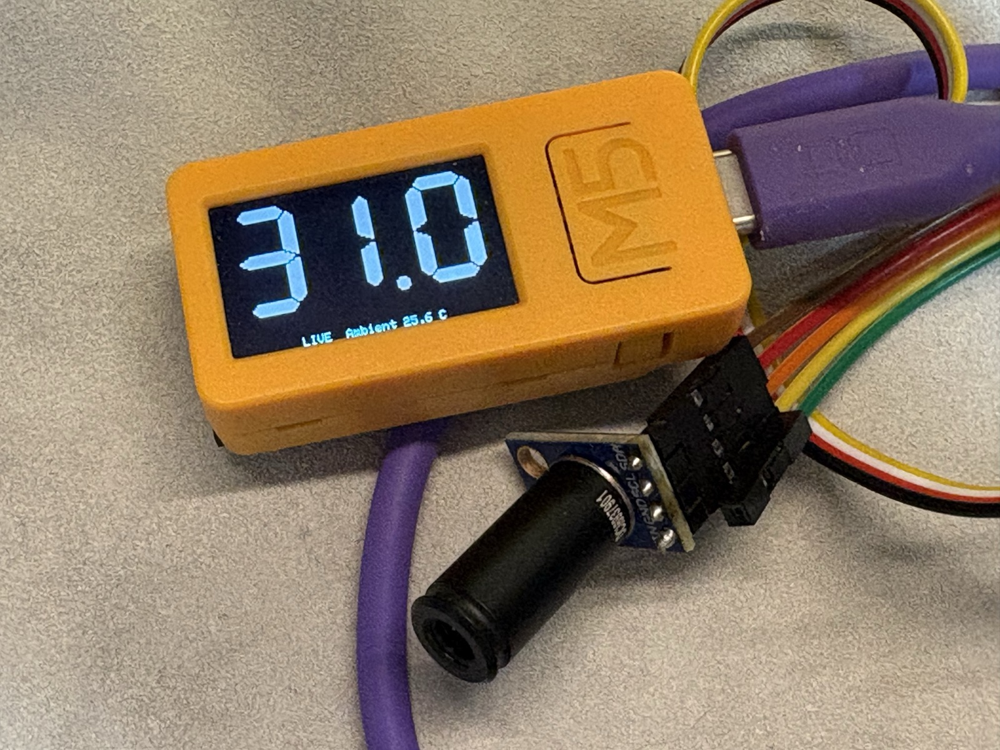
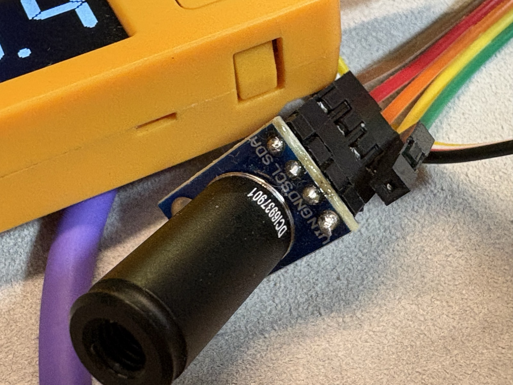
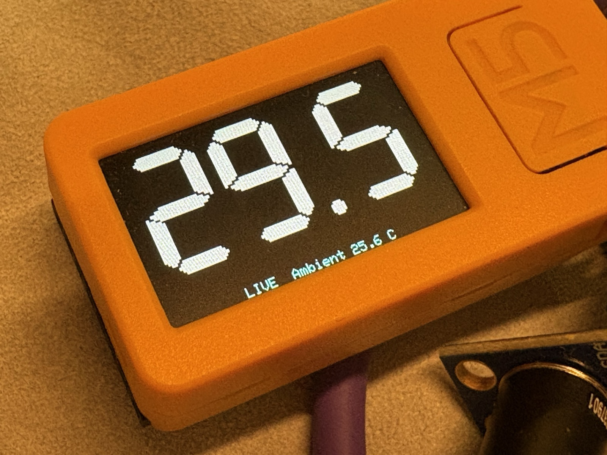

# STICKCPLUS2-Thermometer

[English](README.md) | **日本語**

M5StickC Plus2 と GY-906（MLX90614）を使用した非接触赤外線温度計です。

通常時は対象物の温度をリアルタイム表示し、BtnAを押している間に測定、指を離した時点で直近の測定値から中央値を求めて結果をHOLDします。

## 写真

## 写真

<p align="center">
  
  
  
</p>

## ハードウェア

- M5StickC Plus2
- GY-906 / MLX90614 赤外線温度センサー
  - 使用中のモジュールは狭角タイプ（DCI系）
- Grove接続用配線

## 配線

GY-906 と M5StickC Plus2 の Grove ポートを以下のように接続します。

| GY-906 | M5StickC Plus2 |
|---|---|
| VIN | 5V |
| GND | GND |
| SCL | G32 |
| SDA | G33 |

I2C設定:

```cpp
constexpr int SDA_PIN = 33;
constexpr int SCL_PIN = 32;
constexpr uint8_t MLX_ADDR = 0x5A;
```

> この構成では M5StickC Plus2 の Grove 側 GPIO32 / GPIO33 を I2C として使用します。

## 必要なライブラリ

Arduino IDE で以下のライブラリを使用します。

- M5StickCPlus2
- Adafruit MLX90614
- Wire

スケッチ:

```text
STICKCPLUS2-Thermometer.ino
```

## 操作

動作は3つの状態で構成されています。

```text
LIVE
  │
  │ BtnAを押す
  ▼
MEASURING
  │
  │ BtnAを押している間、測定を継続
  │
  │ BtnAから指を離す
  ▼
HOLD
  │
  │ 60秒経過
  ▼
LIVE
```

### LIVE

起動後の通常状態です。

- 約150ms間隔で温度を取得
- 対象物温度をリアルタイム表示
- EMAで表示値を平滑化
- BtnAを押すと `MEASURING` へ移行

表示例:

```text
       26.7

LIVE  Ambient 25.4 C
```

### MEASURING

BtnAを押している間の測定状態です。

- 温度測定を継続
- 表示値はリアルタイム更新
- HOLD確定用として生の対象物温度を保持
- 常に直近最大5サンプルを使用
- BtnAから指を離すと測定結果を確定

表示例:

```text
       26.8

MEAS  Ambient 25.4 C
```

### HOLD

BtnAから指を離した瞬間に移行します。

MEASURING中の直近最大5点の生データから中央値を求め、その値を測定結果として固定表示します。

表示例:

```text
       26.8

HOLD  Ambient 25.4 C
```

HOLDは60秒間継続し、その後自動的にLIVEへ戻ります。

HOLD中にBtnAを押した場合は、60秒を待たずにLIVEへ戻ります。

## 測定値の処理

### リアルタイム表示

LIVEおよびMEASURINGの表示にはEMA（指数移動平均）を使用します。

```text
filtered = 0.35 × raw + 0.65 × previous
```

設定値:

```cpp
constexpr float EMA_ALPHA = 0.35f;
```

センサーを手持ちした際の細かな揺れによる表示のちらつきを抑える目的です。

### HOLD結果

HOLD値にはEMA値を使用しません。

MEASURING中に取得した**直近最大5点の生データの中央値**を使用します。

例:

```text
26.7
26.8
27.5
26.9
26.8
```

ソートすると:

```text
26.7
26.8
26.8
26.9
27.5
```

HOLD値:

```text
26.8 C
```

一時的に測定位置がずれた場合などの外れ値の影響を受けにくくするためです。

短時間のボタン操作で5点に満たない場合は、取得できたサンプルから中央値を計算します。

## タイミング

| 項目 | 設定 |
|---|---:|
| 温度取得間隔 | 150 ms |
| HOLD時間 | 60秒 |
| 自動Power Off | 最後のボタン操作から300秒 |
| HOLD用サンプル | 直近5点 |
| EMA係数 | 0.35 |

## ディスプレイ

M5StickC Plus2 の 240 × 135 LCD を横向きで使用します。

- 対象物温度: 大型表示
- LIVE: シアン
- MEAS: グリーン
- HOLD: イエロー
- Ambient: 画面下部に小さく表示

描画には `M5Canvas` のSpriteを使用し、画面全体をバッファへ描画してからLCDへ転送します。

## センサー初期化

MLX90614 のI2Cアドレスは `0x5A` です。

起動時には最大10回の初期化リトライを行います。

```text
Attempt 1/10: 0x5A found, MLX90614 OK
```

センサーを認識できない場合は画面にエラーを表示します。

## 電源管理

最後のBtnA操作から300秒経過すると、自動的にPower Offします。

温度変化や通常のLIVE測定はユーザー操作とはみなされません。

## Serial Monitor

デバッグ時は115200 bpsでSerial Monitorを使用できます。

代表的なログ:

```text
STATE -> LIVE

BTN A: PRESS
STATE -> MEASURING

Raw: 26.71 C  Filtered: 26.68 C  Ambient: 25.40 C
Raw: 26.83 C  Filtered: 26.73 C  Ambient: 25.40 C
Raw: 26.90 C  Filtered: 26.79 C  Ambient: 25.41 C

BTN A: RELEASE
MEASURING -> HOLD
STATE -> HOLD result=26.83 C samples=5 read=OK
```

## 注意事項

MLX90614は対象物から放射される赤外線を測定する非接触温度センサーです。

測定結果は以下の影響を受けます。

- 対象物との距離
- センサーの視野角（FOV）
- 対象物の放射率
- 測定対象が視野内を十分に占めているか
- ガラスなど赤外線を透過しにくい物体越しの測定

狭角センサーでも、距離が離れるほど測定範囲は広がります。小さな対象を測る場合は、測定距離を短くする方が安定します。

## 今後の拡張候補

- Wi-Fi接続
- HOLD確定時のMQTT publish
- Home Assistant連携
- NTP時刻同期
- 測定履歴保存
- バッテリー残量表示
- OTAアップデート

ネットワーク機能を追加する場合も、温度計そのものはネットワーク障害に依存せず動作し、HOLD確定後のデータ送信だけを追加する構成が適しています。

## ライセンス

このプロジェクトは [MIT License](LICENSE) の下で公開されています。

Copyright (c) 2026 omiya-bonsai
